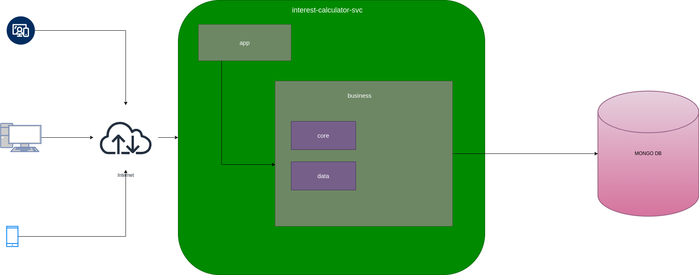

# interest-calculator-svc
interest-calculator-svc is production grade service to calculate simple interest and store it on mongo DB

This service provides different feature like api extendability, reuseability, sepreration of concern

## Design Decision 
1. App layer mainly contains very specfic code to a different apis (i.e. in our case interest-cal-api) and which takes externl input. e.g 
2. Business layer coantains packages which used by the app layer to process the request related store and retrive data. It also some reusable components. 
3. There should be no circular imorts and imports are only done from down to top (i.e. any code in app packages could import any package in business layer.) But vicea-verse should not be done.    
4. This service could be build with different version. Need to sepecify in Makefile. Default value of VERSION  is 1.0

## Design 



# How to run Service

### **pre requisites**
1. Install docker and docker compose

### **Steps to run**
To run service run this command in interest-calculator-svc.This first test the service and build the docker image will specified version and once done will spawn two containers (i.e.mongodb-container, interest-cal)
```
make start
```
To stop service run this command in interest-calculator-svc.This will stop and removed the running containers
```
make stop
```
To test service seperatly run this command. This will test the service withour caching the last output and also checks the race condition. 
```
make test
```


## Project Tree
```
.
├── app
│   └── services
│       └── interest-cal-api
│           ├── handlers
│           │   ├── handler.go
│           │   └── v1
│           │       └── sigrp
│           │           └── sigrp.go
│           ├── main.go
│           └── start
│               └── start.go
├── bin
│   └── interest-cal-api
├── business
│   ├── core
│   │   ├── entities
│   │   │   └── simpleinterest.go
│   │   └── simpleInterest
│   │       ├── fakerepo
│   │       │   ├── fakeMongo
│   │       │   │   └── fake_repository.go
│   │       │   └── genfake.go
│   │       ├── repo
│   │       │   └── repo.go
│   │       ├── svc.go
│   │       └── svc_test.go
│   └── data
│       └── repoConn.go
├── docker
│   ├── docker-compose.yml
│   └── dockerfile
├── go.mod
├── go.sum
├── Makefile
└── README.md
```